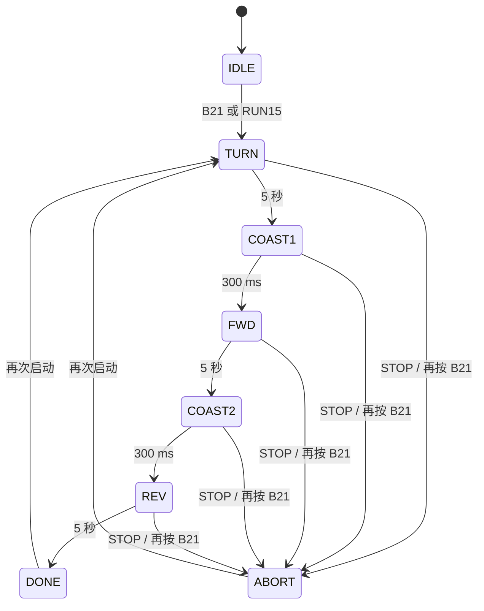

# 从零写出转圈、直行、倒车程序（历史开环版本）

> **历史资料。** 本文对应之前的无编码器开环练习，下面的 H8 接线、5 秒动作和固定 PWM 均不适用于当前固件。当前工程已升级为编码器速度 PID + MPU6050 右转路线；请以 [serial_debug.md](serial_debug.md)、[wiring.md](wiring.md)、[architecture.md](architecture.md) 和当前源码为准。

这份教程按当前 `car` 工程讲解怎样把“按一次按键后依次执行三段动作”写成 MSPM0G3507 程序。当前固件的行为是：原地转圈 5 秒、直行 5 秒、倒车 5 秒；改变方向前先滑行 300 ms。每段使用固定 200‰ PWM，不读编码器，也不运行 PID。

## 1. 先确认接线

当前工程把天猛星 H8 显示屏接口的信号脚复用为 PWM。接线如下：

| 天猛星 H8 | MSPM0 定时器输出 | AT8236 J4 | 信号 |
| --- | --- | --- | --- |
| 3 `LCD_SCL` | PB9 / TIMA0_C1 | 4 | AIN1 |
| 4 `LCD_SDA` | PB8 / TIMA0_C0 | 3 | AIN2 |
| 5 `LCD_RES` | PB10 / TIMG8_C0 | 2 | BIN1 |
| 6 `LCD_DC` | PB11 / TIMG8_C1 | 1 | BIN2 |

H8 的 1、2 脚是电源脚，不是 PWM。确认板上 0Ω 电阻配置后，可用 H8-1 作为公共地接到 AT8236 GND；H8-2 不接电机输入。使用 H8-3 到 H8-6 时要拔下 LCD。AT8236 的 12V 电机供电仍接它的 VM 电源端，MCU 引脚只接驱动器的四个逻辑输入。

针脚来源和八针接口完整说明见[工作区天猛星参考索引](../../../docs/reference/Tianmengxing/INDEX.md)及[本工程接线记录](wiring.md)。

## 2. 把动作写成状态机

不要在 `main()` 里写三个阻塞式的 5 秒延时。阻塞时无法及时处理停止命令，后续也很难加转弯、传感器或故障状态。这里用枚举表示每个阶段：

| 状态 | 两轮命令（A，B） | 持续时间 | 完成后 |
| --- | --- | --- | --- |
| `TURN` | `(+200, -200)` | 5 s | 两路滑行 300 ms |
| `FWD` | `(+200, +200)` | 5 s | 两路滑行 300 ms |
| `REV` | `(-200, -200)` | 5 s | 两路滑行并结束 |
| `IDLE` / `DONE` / `ABORT` | `(0, 0)` | — | 等待启动或保持停止 |

每次 5 ms 调度只做一次状态更新：检查停止请求、计算当前阶段经过时间、写入电机命令，必要时切换到下一个状态。状态流如下：



**三段各运行 5 秒**，另有两段 300 ms 的方向切换滑行时间，所以从启动到结束大约 15.6 秒。中间滑行能减少电机还在转动时直接反向造成的冲击。

## 3. 用 5 ms 定时器计时

SysConfig 把 `CONTROL_TICK` 配成 5 ms 周期。定时器中断只递增 tick 并设置遥测标志，不在中断里打印或驱动电机。前台用 tick 差换算毫秒：

```c
elapsed_ms = (now_tick - s_stage_start_tick) * 5U;
if (elapsed_ms >= 5000U) {
    BspMotor_Coast();
    s_state = DEMO_MISSION_PAUSE_AFTER_TURN;
    s_stage_start_tick = now_tick;
}
```

每次进入新阶段都重设 `s_stage_start_tick`。单独保存 `s_mission_start_tick`，用于串口输出整段任务的总时间。

## 4. 用有符号命令表达轮子方向

在上层统一规定：正数表示该轮实际向前，负数表示该轮实际向后，数值绝对值是 PWM 千分比。于是三个动作可以直接读懂：

```c
/* 原地转圈 */
BspMotor_SetCommand(+200, -200);

/* 直行 */
BspMotor_SetCommand(+200, +200);

/* 倒车 */
BspMotor_SetCommand(-200, -200);
```

`bsp/motor_pwm.c` 再把正负方向转换成 AT8236 的 IN1/IN2 电平和 PWM。用户确认左轮向前方向正确，且此前等命令会原地转圈；因此当前 BSP 对 Motor B 做了电气方向反相，使正值对 A、B 两轮都表示物理前进。这个方向设置是针对当前底盘和接线的，换线或换电机后要重新验证。

当命令为零时，BSP 将电机输入都置低，对应当前选用的滑行停止方式。停车后车轮仍可能靠惯性继续转一段距离。

## 5. 15 秒程序怎样启动和停止

- 上电后电机输入保持低电平，任务处于 `IDLE`。
- 按天猛星 B21，或在 CH340E UART0 串口发送换行结束的 `RUN15`，进入 `TURN`。
- 再按 B21 或发送 `STOP`，设置停止请求；下一个 5 ms 调度周期滑行并进入 `ABORT`。
- 串口为 115200、8-N-1；遥测字段包括任务总毫秒数、状态和两轮 PWM，不含编码器数据。

UART 中断只把收到的字符放进小缓冲区，命令识别和动作调用发生在前台。定时器、串口及应用入口分别见 [`app/app.c`](../../app/app.c)、[`protocol/serial_console.c`](../../protocol/serial_console.c) 和 [`car.c`](../../car.c)。

## 6. 怎样修改速度和时间

当前所有运动阶段都使用 `MOTOR_PWM_PERMILLE`，定义在 [`mission/demo_mission.c`](../../mission/demo_mission.c)：

```c
#define MOTION_STAGE_MS (5000U)
#define DIRECTION_CHANGE_PAUSE_MS (300U)
#define MOTOR_PWM_PERMILLE (200)
```

- 想让每段时间变化，改 `MOTION_STAGE_MS`，单位是毫秒。
- 想让运行更慢，只小幅增加或减少 `MOTOR_PWM_PERMILLE`，例如每次改 20–30‰，每次只改一个版本观察。
- 两侧速度相同后保持两轮 PWM 命令幅值相同；如果再次出现原地转圈，先核对 H8 到 J4 的 AIN/BIN 对应和 Motor B 方向映射。
- 非零 PWM 太低时电机可能无法克服静摩擦而不转；提高后小车可能突然启动。先让驱动轮离地检查方向，再在空旷平地测试。
- 当前没有编码器、PID 或直线纠偏，固定相同 PWM 不能保证两轮转速始终一致，也不能承诺绝对走直。

程序的实际参数和引脚配置以 [`car.syscfg`](../../car.syscfg) 为准。不要手改 `Debug/ti_msp_dl_config.c` 或 `.h`；修改 `.syscfg` 后先运行静态检查和 SysConfig 生成，再完整构建并导出 Intel HEX。

## 7. 当前验证边界

当前工程已完成 SysConfig 校验、CCS 编译和链接，并生成 [`car.hex`](../../car.hex)。上板后仍需观察启动横幅和 `state=TURN/FWD/REV` 遥测，核对每段方向、5 秒时长及停止行为。没有观察到实际电机结果前，不把源码/构建通过等同于实车验证。
