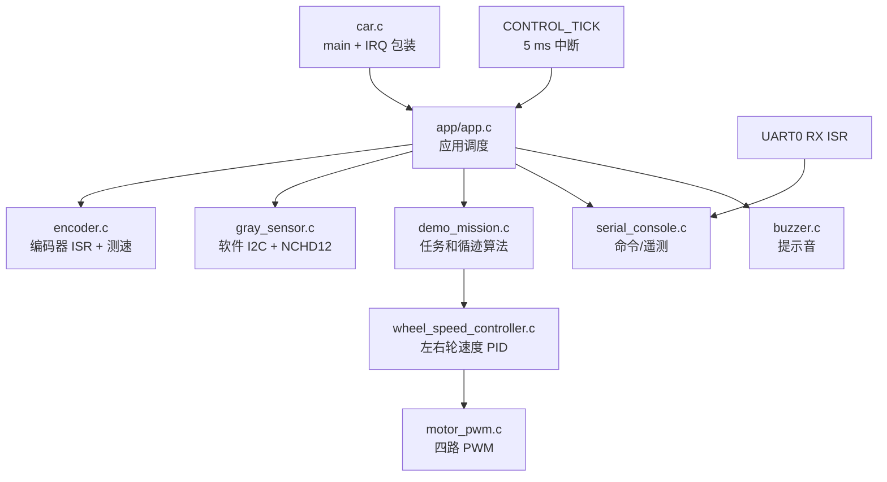

# car 项目完整解析与独立复现指南

> 面向读者：只会写 `Hello World`，电路基础只知道欧姆定律，对模拟电子技术不了解的初学者。
>
> 目标：读完本文后，你能够理解当前 `car` 工程的每个模块，能够根据数据手册判断一个器件应该怎样接线、怎样配置、怎样读取和怎样验证，并能够在保持当前工程约束的前提下重新搭建、编译、烧录和排查这个项目。
>
> 文档位置：`car/docs/car_project_detailed_guide.md`
>
> 事实来源优先级：
>
> 1. 当前工程的 `car.syscfg`、源码和生成头文件；
> 2. 当前工程内的器件资料和接线记录；
> 3. 数据手册中的电气和时序规定；
> 4. 通用经验和推测。
>
> 如果某一项没有经过实车或示波器确认，本文会明确写成“假设”“初始值”或“待实测”，不会把它包装成已经验证的性能结论。

---

## 目录

1. [先理解项目要做什么](#1-先理解项目要做什么)
2. [当前工程的真实边界](#2-当前工程的真实边界)
3. [项目架构](#3-项目架构)
4. [先补齐需要的电路和嵌入式基础](#4-先补齐需要的电路和嵌入式基础)
5. [硬件、接线和数据手册映射](#5-硬件接线和数据手册映射)
6. [CCS、SysConfig 和工程文件](#6-ccssysconfig-和工程文件)
7. [启动和 5 ms 运行周期](#7-启动和-5-ms-运行周期)
8. [算法实现](#8-算法实现)
9. [每个代码模块的详细解析](#9-每个代码模块的详细解析)
10. [如何从数据手册独立开发一个模块](#10-如何从数据手册独立开发一个模块)
11. [完整复现步骤](#11-完整复现步骤)
12. [代码质量、已知问题和改进路线](#12-代码质量已知问题和改进路线)
13. [调试和故障排查](#13-调试和故障排查)
14. [复现记录模板](#14-复现记录模板)
15. [附录：术语和公式](#15-附录术语和公式)

---

## 1. 先理解项目要做什么

### 1.1 把小车想象成一个闭环系统

小车不是“给电机一个数字就会自动走直线”。它是一个不断重复下面过程的闭环：

```text
传感器看到什么
        ↓
把电信号翻译成数字
        ↓
根据数字判断线路位置和左右轮速度
        ↓
计算左右轮应该多快
        ↓
调整电机驱动 PWM
        ↓
车轮运动，传感器看到新的结果
```

在当前项目中有两层闭环：

1. **灰度位置环**：判断黑线在传感器左边还是右边，计算转向修正。
2. **轮速环**：编码器测量左右轮实际速度，分别调整两个电机的 PWM。

灰度位置环解决“应该往哪边转”，轮速环解决“电机实际有没有按要求转起来”。

### 1.2 当前固件的两阶段演示

当前 `main` 版本的按键流程是：

```text
上电
  │
  ├─ 第一次按 B21
  │     └─ LINE30：普通灰度循迹 30 秒
  │           └─ 到时进入 DONE，电机滑行停止
  │
  └─ 第二次按 B21
        └─ RECT30：矩形跑道循迹 30 秒
              ├─ 识别右直角或左直角
              ├─ 原地差速转弯
              └─ 中心线重新出现后恢复普通循迹
```

串口命令与按键共用任务状态机：

| 命令 | 当前行为 |
| --- | --- |
| `RUNPID` | 启动普通 `LINE30`，名称保留自早期版本 |
| `RUN15` | 和 `RUNPID` 相同，当前不是 15 秒任务 |
| `RUNRECT` | 直接启动 `RECT30` |
| `STOP` | 请求停止，进入 `ABORT` |

### 1.3 复现成功的定义

完成编译不等于小车完成。建议把结果分成六级记录：

1. **源码检查**：文件结构、接口和宏名称正确。
2. **SysConfig 生成**：引脚、外设和时钟能够生成代码。
3. **编译**：每个 `.c` 能变成目标文件。
4. **链接**：目标文件能生成 `.out`。
5. **固件镜像**：`.out` 能转换成通过校验的 Intel HEX。
6. **物理验证**：板上串口、传感器、编码器和小车动作符合预期。

本文会分别说明这六级，避免“编译成功所以硬件一定正确”的误解。

---

## 2. 当前工程的真实边界

### 2.1 MCU、软件和硬件目标

| 项目 | 当前事实 |
| --- | --- |
| MCU | TI MSPM0G3507 |
| 封装 | LQFP-64(PM) |
| 工程类型 | CCS Theia、TI Arm Clang、无 RTOS |
| SDK | MSPM0-SDK 2.11.0.07 |
| SysConfig | 工程声明 1.26.2 |
| 编译器 | TI Arm Clang 5.1.1.LTS |
| 调试目标 | `targetConfigs/MSPM0G3507.ccxml`，当前使用 SEGGER J-Link 配置 |
| 主入口 | [`car.c`](../car.c) |
| 配置源 | [`car.syscfg`](../car.syscfg) |
| 固件镜像 | [`car.hex`](../car.hex) |

当前 `car` 项目针对天猛星小车的接线。它和工作区中的 `empty` LaunchPad 基线不是同一块板，不能把 `empty` 项目的 B21、LED 或接插件接线表直接套到本项目。

### 2.2 当前真正使用的硬件

- MSPM0G3507 控制板。
- AT8236 双路有刷直流电机驱动模块。
- 两个 MG513X 霍尔编码器减速电机。
- NCHD12 12 路灰度传感器，通过软件模拟 I²C 读取。
- 板载 CH340E USB 转串口，用于命令和遥测。
- PB21 按键和 PB27 无源蜂鸣器。

### 2.3 当前没有参与运行的硬件

工程保留了两个姿态传感器驱动，但当前 `app.c` 不调用：

- `bsp/mpu6050.c`：PB2/PB3/PB1 预留，当前启动信息明确显示 `MPU6050 disabled`。
- `bsp/jy61s_uart.c`：PB15/PB16 的 UART2 预留，当前未接入任务。

因此当前 `RECT30` 依靠灰度位图和轮速闭环，不依靠陀螺仪的 yaw 角判断直角。

---

## 3. 项目架构

### 3.1 目录结构

```text
car/
├─ car.c                         # C 入口、中断向量包装
├─ car.syscfg                    # SysConfig 唯一配置源
├─ targetConfigs/
│  └─ MSPM0G3507.ccxml           # 调试/烧录目标配置
├─ app/
│  ├─ app.c                      # 初始化、按键、串口、5 ms 调度
│  └─ app.h
├─ bsp/
│  ├─ motor_pwm.c/h              # AT8236 四路 PWM 和正负电机命令
│  ├─ encoder.c/h                # AB 相编码器计数和速度换算
│  ├─ gray_sensor.c/h            # NCHD12 软件 I²C 和位置计算
│  ├─ buzzer.c/h                 # 非阻塞蜂鸣器提示
│  ├─ mpu6050.c/h                # 保留的 MPU6050 驱动
│  └─ jy61s_uart.c/h             # 保留的 JY61S 串口驱动
├─ control/
│  └─ wheel_speed_controller.c/h # 左右轮独立增量式 PID
├─ mission/
│  └─ demo_mission.c/h           # LINE30、RECT30、直角状态机
├─ protocol/
│  └─ serial_console.c/h         # UART0 命令解析和遥测输出
├─ docs/                         # 工程说明、供应商资料和本教程
├─ tools/
│  └─ build_validate_hex.ps1     # 编译、生成和校验 HEX
├─ Debug/                        # CCS 生成目录，不手工编辑
└─ PROJECT_STATE.md              # 对话接续和验证状态
```

### 3.2 调用关系



### 3.3 为什么 ISR 只做很少的事情

ISR 是“中断服务函数”。它会打断主循环，如果在 ISR 中做软件 I²C、浮点 PID 或串口打印，可能导致：

- 下一个编码器脉冲到来时还没有退出上一次 ISR；
- 定时器 tick 丢失；
- UART FIFO 溢出；
- 控制周期不稳定。

当前设计的原则是：

| 位置 | 允许做的事 |
| --- | --- |
| GPIO 编码器 ISR | 读取 A 中断、读取 B 电平、加一或减一、清标志 |
| UART0 RX ISR | 读取 FIFO，拼一行命令 |
| 5 ms 定时器 ISR | `s_control_ticks++`、累积待处理 tick、设置遥测标志 |
| 前台 `App_RunOnce` | I²C、测速、浮点计算、PID、电机输出和串口打印 |

这个边界是理解整个工程的关键：**中断负责“记账”，主循环负责“做决定”。**

### 3.4 5 ms 控制周期的实际顺序

每次前台取到一个或多个待处理 tick，大致执行：

```text
1. 原子取出并清零待处理 tick
2. 读取编码器累计计数，更新速度和位置
3. 用软件 I²C 读取 NCHD12 两个字节
4. 根据任务状态选择普通循迹或矩形直角状态机
5. 生成左右轮目标速度
6. 每累计到 20 ms 时运行一次轮速 PID
7. 将 PID 输出写入 AT8236 四路 PWM
8. 更新蜂鸣器
9. 每约 100 ms 输出一行遥测
```

5 ms 是任务采样周期，轮速 PID 的有效更新周期是 20 ms。这两个周期不要混为一个数字。

---

## 4. 先补齐需要的电路和嵌入式基础

### 4.1 电压、电流和逻辑电平

你可以把 MCU GPIO 暂时理解成一个只能读写高低电平的数字开关：

- 低电平接近 0 V，代码中通常表示 `0`；
- 高电平接近 3.3 V，代码中通常表示 `1`；
- GPIO 能承受的电流和电压有限，不能直接驱动电机；
- 电机驱动器的功率输出和 MCU 的逻辑输入必须分开理解。

欧姆定律 `V = I × R` 只能帮助你理解电阻、电流和电压关系，不能替代器件的最大输入电压、最大输出电流、时序和热限制。

### 4.2 PWM 是什么

PWM 是周期性高低电平。周期固定时，高电平所占的比例叫占空比：

```text
占空比 = 高电平时间 / 一个周期的总时间
```

当前 PWM 定时器时钟是 32 MHz，周期计数值是 3200：

```text
PWM 频率 = 32,000,000 / 3200 = 10,000 Hz = 10 kHz
```

代码使用千分比表示命令：

```text
0      → 0 %
500    → 50 %
1000   → 100 %
```

但是当前 AT8236 控制不是简单的“一个 PWM 脚加一个方向脚”。代码对两个输入都写 PWM，以实现慢衰减。必须结合 AT8236 的真值表理解，不能只看变量名。

### 4.3 H 桥是什么

AT8236 的 H 桥用两个输入控制电机两端：

| IN1 | IN2 | 电机端状态 | 数据手册含义 |
| --- | --- | --- | --- |
| 0 | 0 | 两端高阻 | 滑行、休眠 |
| 1 | 0 | OUT1 高、OUT2 低 | 正向 |
| 0 | 1 | OUT1 低、OUT2 高 | 反向 |
| 1 | 1 | 两端低 | 刹车 |

AT8236 手册还规定了 PWM 的快衰减和慢衰减组合。当前代码在非零命令下保持一个输入接近 100%，另一个输入用 `1000 - 幅值` 表示慢衰减；命令为零时写双低电平，让电机滑行。

### 4.4 编码器 AB 相是什么

一个增量式正交编码器通常输出 A、B 两路方波。两路相位相差约四分之一周期：

```text
正方向示意：A: _|‾|_|‾|_
           B: __|‾|_|‾|_
```

在 A 的上升沿读取 B 电平，就可以判断方向。当前代码只在 A 上升沿计数，等于每个完整 AB 周期只使用一个边沿，优点是简单，缺点是分辨率比四倍频低。

### 4.5 I²C 的两个重要概念

I²C 的 SDA 和 SCL 通常不是“主动输出高电平”，而是：

- 输出低：主动把线拉低；
- 输出高：释放 GPIO，由上拉电阻把线拉高。

这叫开漏/开集电极等效结构。多个器件可以共享总线，但任何器件都不能强行把已经被别人拉低的线推成高电平。

当前 NCHD12 驱动用 GPIO 动态切换“输出低”和“输入释放”来模拟这个行为。

---

## 5. 硬件、接线和数据手册映射

### 5.1 主接线表

下表是当前 `car.syscfg` 和 BSP 实际使用的映射，优先级高于供应商 STM32/Arduino 示例。

| MSPM0G3507 引脚 | SysConfig 名称/外设 | 外部信号 | 当前用途 |
| --- | --- | --- | --- |
| PA0 | `MOTOR_A_PWM` channel 1 / TIMG8_C1 | AT8236 AIN1 | 左电机 H 桥输入 |
| PA1 | `MOTOR_A_PWM` channel 0 / TIMG8_C0 | AT8236 AIN2 | 左电机 H 桥输入 |
| PA8 | `MOTOR_B_PWM` channel 0 / TIMA0_C0 | AT8236 BIN1 | 右电机 H 桥输入 |
| PA9 | `MOTOR_B_PWM` channel 1 / TIMA0_C1 | AT8236 BIN2 | 右电机 H 桥输入 |
| PA27 | GPIO 上升沿中断 | 左编码器 E1A | 计数边沿 |
| PA25 | GPIO 输入 | 左编码器 E1B | 判断左轮方向 |
| PB25 | GPIO 上升沿中断 | 右编码器 E2A | 计数边沿 |
| PB20 | GPIO 输入 | 右编码器 E2B | 判断右轮方向 |
| PA29 | GPIO 软件 I²C | NCHD12 SCL | 灰度总线时钟 |
| PA30 | GPIO 软件 I²C | NCHD12 SDA | 灰度总线数据 |
| PA10 | UART0 TX | 板载 CH340E RXD | 发送遥测 |
| PA11 | UART0 RX | 板载 CH340E TXD | 接收命令 |
| PB21 | GPIO 上拉输入 | B21 按键 | 低电平表示按下 |
| PB27 | GPIO 输出 | 无源蜂鸣器 | 启动/停止提示 |
| PB2 | I2C1 SCL | MPU6050 SCL | 保留，当前未使用 |
| PB3 | I2C1 SDA | MPU6050 SDA | 保留，当前未使用 |
| PB1 | GPIO 上升沿中断 | MPU6050 INT | 保留，当前只清中断 |
| PB15 | UART2 TX | JY61S RX | 保留，当前未使用 |
| PB16 | UART2 RX | JY61S TX | 保留，当前未使用 |

### 5.2 AT8236：数据手册事实和工程选择

供应商手册位置：[`vendor/6.芯片手册/AT8236芯片手册.PDF`](vendor/6.%E8%8A%AF%E7%89%87%E6%89%8B%E5%86%8C/AT8236%E8%8A%AF%E7%89%87%E6%89%8B%E5%86%8C.PDF)。

手册中的关键事实：

- 推荐功率电源 `VM`：5.5–36 V；
- 推荐连续输出电流约 3 A，峰值范围取决于散热和应用条件；
- 逻辑输入允许范围 0–5.25 V；
- PWM 输入频率最高 100 kHz；
- `VREF` 是 8236 版本的参考电压输入，用于设置峰值电流；
- `IN1/IN2` 内置下拉；
- `00` 是滑行/休眠，`11` 是刹车。

当前工程的工程事实：

- PWM 时钟 32 MHz、计数值 3200，得到 10 kHz；
- 电机 A 使用 PA0/PA1，电机 B 使用 PA8/PA9；
- 代码把零命令写成双低电平，因此“停止”是滑行，不是刹车；
- Motor B 的逻辑方向在 `motor_pwm.c` 中反相，这是根据当前实际接线架空测试得出的工程修正，不是 AT8236 数据手册的默认方向。

**为什么不能复制供应商示例？** 供应商例程使用的是其他 MCU 的引脚、定时器和电机接线。数据手册告诉你 AT8236 的电气规则，`car.syscfg` 才告诉你当前 MSPM0 的实际引脚。

### 5.3 电机和编码器：哪些是数据，哪些是假设

当前编码器代码采用：

```text
PPR = 13
减速比 = 28
每轮计数 = 13 × 28 = 364 count/rev
轮径 = 65 mm
轮周长 = π × 65 ≈ 204.20 mm
每个计数 ≈ 204.20 / 364 ≈ 0.561 mm
```

这些参数中：

- 13 PPR、1:28、65 mm 是当前项目输入和初始配置；
- `364 count/rev` 是在“只统计 A 相上升沿”的定义下计算出来的；
- 供应商资料中的编码器电平不自动证明可以直接接到 MSPM0；
- 必须实测 A/B 输出高电平、低电平、相位关系和实际一圈计数。

建议把车架空，手动让一个车轮完整转一圈：

1. 清零计数；
2. 只转左轮一圈，记录左计数；
3. 只转右轮一圈，记录右计数；
4. 正转和反转各做一次；
5. 如果一圈不是约 364，先修改换算常数或重新确认 PPR/减速比定义。

不要把“电机型号写着 13 PPR”直接当成“输出轴每圈一定是 364 个代码计数”。PPR 可能指电机轴、霍尔周期、单相边沿或四倍频计数，必须看数据手册定义和实测波形。

### 5.4 NCHD12：从器件协议到代码

当前资料把 NCHD12 当作 PCA9555 兼容的 12 路数字输入扩展器使用：

- 7 位地址默认按 `0x20` 理解；
- 8 位写地址默认 `0x40`；
- 8 位读地址默认 `0x41`；
- 输入寄存器从 `0x00` 开始；
- 连续读取两个字节，低 12 位代表 12 个灰度通道；
- 当前约定 bit0 在传感器右侧，bit11 在左侧。

代码启动时扫描写地址 `0x40, 0x42, ..., 0x4E`，兼容 A0/A1/A2 地址焊盘的变化。正常读取流程是：

```text
START
写器件地址（写）
写寄存器地址 0x00
重复 START
写器件地址（读）
读低字节，主机 ACK
读高字节，主机 NACK
STOP
```

总线阶段被记录为：

| `bus_stage` | 含义 |
| --- | --- |
| 1 | 器件写地址没有 ACK |
| 2 | 寄存器地址没有 ACK |
| 3 | 读地址没有 ACK |
| 4 | 已进入数据阶段 |

`gray_bus=OK` 只表示一次完整读事务完成；`gray=0x0000` 仍然可能表示当前没有检测到线路。

### 5.5 NCHD12 的 12→8 虚拟通道迁移

参考的八路算法需要 `0..7` 八个输入，但当前硬件是 12 路。因此 `mission/demo_mission.c` 使用以下分组：

| 虚拟通道 | 原始通道 | 位置 |
| --- | --- | --- |
| 0 | bit0 | 最右侧 |
| 1 | bit1 或 bit2 | 右外侧 |
| 2 | bit3 | 右内侧 |
| 3 | bit4 或 bit5 | 右中心 |
| 4 | bit6 或 bit7 | 左中心 |
| 5 | bit8 | 左内侧 |
| 6 | bit9 或 bit10 | 左外侧 |
| 7 | bit11 | 最左侧 |

这是为了保留八路算法的空间结构，不代表 NCHD12 的每个物理光电单元完全等价。必须通过串口的 `gray` 和 `gray8` 字段实测确认。

### 5.6 UART0、按键和蜂鸣器

UART0 配置为 115200、8 数据位、无校验、1 停止位。PA10/PA11 直接连接板载 CH340E。命令必须以换行结束。

B21 是 PB21 上拉输入：

- 未按下：读到高电平；
- 按下：按键把引脚拉低，读到低电平；
- `app.c` 通过边沿锁存和约 10 ms 延时消抖。

蜂鸣器不是一个独立定时器音频模块，`buzzer.c` 每个控制 tick 更新一次 GPIO，使用非阻塞方式产生短提示音。

### 5.7 MPU6050 和 JY61S 为什么要单独看待

这两个驱动可以帮助你学习 I²C 和串口姿态传感器，但不属于当前车辆闭环：

- 不能因为目录中有 `mpu6050.c` 就说当前任务使用了陀螺仪；
- 如果启用 MPU6050，必须核对地址、上拉、电平、采样率、零偏和 `app.c` 调用顺序；
- 如果启用 JY61S，必须核对帧头、帧长度、校验和、UART 交叉接线和数据超时。

---

## 6. CCS、SysConfig 和工程文件

### 6.1 `car.syscfg` 是唯一配置源

SysConfig 负责生成：

- 时钟和 CPU 频率；
- GPIO 端口和引脚复用；
- PWM 定时器和通道；
- UART/I²C/TIMER 实例；
- 中断名称和向量宏；
- `ti_msp_dl_config.c`、`ti_msp_dl_config.h`、`device_linker.cmd` 等生成文件。

因此：

> 想改引脚、外设实例、波特率、定时器周期或中断，先改 `.syscfg`，再重新生成。

不要直接编辑 `Debug/ti_msp_dl_config.c` 或 `Debug/ti_msp_dl_config.h`。下次 SysConfig 运行时这些改动会被覆盖。

### 6.2 当前 SysConfig 配置摘要

| 模块 | 当前设置 | 作用 |
| --- | --- | --- |
| SYSCTL | 32 MHz 基础系统时钟，关闭 HFXT/PLL | 统一 CPU、UART、PWM 和 I²C 软件延时基准 |
| TIMG8 | 周期 3200、边沿对齐 | Motor A 两路 PWM |
| TIMA0 | 周期 3200、边沿对齐 | Motor B 两路 PWM |
| TIMG12 | 周期 5 ms、ZERO 中断 | 控制调度 tick |
| UART0 | 115200、RX 中断、FIFO | 板载 CH340 命令/遥测 |
| UART2 | 115200、RX 中断 | JY61S 预留 |
| I2C1 | Fast mode 400 kHz | MPU6050 预留 |
| GPIO | 编码器、B21、蜂鸣器、软件 I²C | 其他板级信号 |

### 6.3 `@cliArgs`、版本和产品字段

`car.syscfg` 顶部记录了：

```text
device: MSPM0G3507 / MSPM0G350X
package: LQFP-64(PM)
product: mspm0_sdk@2.11.00.07
tool: SysConfig 1.26.2
```

这些元数据不是注释装饰。SysConfig CLI 会用它们选择器件、封装和 SDK 模块。迁移工程时不要随意把产品版本改成机器上碰巧存在的其他版本。

### 6.4 `.ccsproject`、`.project`、`.cproject` 分别做什么

| 文件 | 作用 |
| --- | --- |
| `.project` | Eclipse/CCS 识别项目名称和工程性质 |
| `.ccsproject` | CCS 设备、目标配置、SDK 来源、打开文件等 CCS 元数据 |
| `.cproject` | Debug 配置、编译器选项、源码目录、链接器选项和产品依赖 |
| `.ccsproject` 的 `origin` | 指向 SDK 示例来源的变量形式，不应改成个人绝对路径 |
| `targetConfigs/MSPM0G3507.ccxml` | 调试器、芯片和连接方式 |

工程变量如 `${COM_TI_MSPM0_SDK_INSTALL_DIR}` 让项目可以在不同电脑上复用。不要把 `D:\TI\...` 或 `C:\Users\...` 写进源码、文档或工程元数据。

### 6.5 生成目录和可提交文件

通常应提交：

- 源码、头文件、`car.syscfg`；
- `.project`、`.cproject`、`.ccsproject`、`.ccxml`；
- 文档、构建脚本和经过校验的 `car.hex`；
- `PROJECT_STATE.md`。

通常不应手工编辑或提交为源代码：

- `Debug/` 下的目标文件、依赖文件、`.out`、`.map`；
- SysConfig 生成的 C/H、链接器文件；
- 临时缓存和 clangd 索引。

---

## 7. 启动和 5 ms 运行周期

### 7.1 `main` 做什么

[`car.c`](../car.c) 只做三件事：

```c
int main(void)
{
    App_Init();
    for (;;) App_RunOnce();
}
```

三个中断包装函数把硬件中断转发给应用层：

- `GROUP1_IRQHandler` → `App_OnEncoderInterrupt`；
- `DEBUG_UART_INST_IRQHandler` → `App_OnUartInterrupt`；
- `CONTROL_TICK_INST_IRQHandler` → `App_OnControlTickInterrupt`。

这样 `car.c` 不知道 PID、灰度或电机细节，入口文件保持简单。

### 7.2 `App_Init` 的初始化顺序

[`app/app.c`](../app/app.c) 当前按以下顺序初始化：

1. `SYSCFG_DL_init()`：应用 SysConfig 生成的时钟、GPIO、PWM、UART、I²C 和 Timer 配置；
2. `BspMotor_Init()`：立即把四个电机输入置为双低电平；
3. `BspGraySensor_Init()`：释放软件 I²C 线，扫描 NCHD12 地址；
4. `BspBuzzer_Init()`：关闭蜂鸣器；
5. `DemoMission_Init(false)`：初始化任务和轮速控制器，明确当前不需要陀螺仪；
6. `SerialConsole_Init()`：清空串口接收状态并发送启动信息；
7. 开启控制 tick、UART0 和编码器中断。

电机先保持滑行停止非常重要。MCU 复位、调试器连接或 SysConfig 初始化时，不能让电机输入残留为任意高电平。

### 7.3 控制 tick 如何到达前台

```c
void App_OnControlTickInterrupt(void)
{
    if (DL_TimerG_getPendingInterrupt(CONTROL_TICK_INST) !=
        DL_TIMER_IIDX_ZERO) return;
    ++s_control_ticks;
    if (s_pending_ticks < UINT8_MAX) ++s_pending_ticks;
    if (++s_telemetry_divider >= 20U) {
        s_telemetry_divider = 0U;
        s_telemetry_due = true;
    }
}
```

5 ms × 20 = 100 ms，所以遥测标志约每 100 ms 置一次。

前台用 `takePendingTicks()` 关闭中断，原子地取走待处理数量，避免读取过程中被 ISR 再次修改。

### 7.4 按键状态管理

`app.c` 维护三个按键演示阶段：

```text
LINE_PENDING → RECTANGLE_PENDING → COMPLETE
```

- 第一次普通任务没有正常完成时，不会解锁第二阶段；
- 第一次任务按 `STOP` 中止后，仍可重新尝试普通任务；
- 第二阶段运行中按 B21 会停止当前任务；
- 正常完成第二阶段后，后续 B21 不再重复演示，可用 `RUNPID` 或 `RUNRECT` 显式重试。

---

## 8. 算法实现

### 8.1 普通 LINE30：12 路位置变成离散误差

`bsp/gray_sensor.c` 先遍历 12 个 bit。对每个有效通道使用：

```text
weight(index) = 2 × index - 11
```

所以：

| bit | 权重 | 解释 |
| --- | ---: | --- |
| 0 | -11 | 右侧 |
| 1 | -9 | 右侧 |
| ... | ... | ... |
| 5/6 | -1/+1 | 中间 |
| ... | ... | ... |
| 11 | +11 | 左侧 |

位置是所有亮通道权重的平均值：

```text
position = Σ(weight_i) / active_count
```

如果本次没有亮通道，驱动保留上一次位置；同时把 `valid` 置为假，让上层知道这不是新鲜的有效线路。

`LINE30` 使用参考仓库风格的离散误差：

```text
position ≤ -9   → e = -10
-9 < position ≤ -6 → e = -7
-6 < position ≤ -4 → e = -5
-4 < position ≤ -2 → e = -3
-2 < position < 0   → e = -1
0 ≤ position ≤ 1    → e = 0
1 < position ≤ 3    → e = 1
3 < position ≤ 5    → e = 3
5 < position ≤ 7    → e = 5
7 < position ≤ 9    → e = 7
position > 9       → e = 10
```

这不是连续的几何角度，而是一个让控制器容易调参的离散等级。

### 8.2 普通循迹的转向计算

当前参数：

```text
Kp = 150
Ki = 0.15
Kd = 12
积分限幅 = ±200
REFERENCE_TURN_SCALE = 2.0
基础速度目标 = 300 mm/s
基础速度加速度限制 = 700 mm/s²
轮距参数 = 45 mm
```

每次有效控制周期：

```text
I ← clamp(I + e, -200, 200)
turn ← Kp × e + Ki × I + Kd × (e - e_previous)
turn ← 2.0 × turn
spin ← 0.001 × 45 × turn
target_A ← base_speed - spin
target_B ← base_speed + spin
```

代码随后把两个目标送给轮速控制器，并由轮速控制器限制到 `±320 mm/s`。

#### 一个具体计算例子

假设灰度重心落在 `position = +5`：

```text
e = 3
e_previous = 0
I 假设当前为 3
turn = 150×3 + 0.15×3 + 12×3 = 486.45
turn × 2 = 972.9
spin = 0.001 × 45 × 972.9 ≈ 43.78 mm/s
```

如果基础速度已到 300 mm/s：

```text
target_A ≈ 256.2 mm/s
target_B ≈ 343.8 mm/s → 轮速上限后约为 320 mm/s
```

这说明当前转向环很容易触发轮速限幅。限幅不是编译错误，但会改变理论 PID 输出，实车调参时必须观察遥测中的 `speed` 和 `pwm_permille`。

### 8.3 RECT30：从 12 路位图识别直角

`RECT30` 不把所有情况都当作普通位置误差，而是先分类：

```text
TRACK
TURN_LEFT
TURN_RIGHT
LOST
```

右直角的主要虚拟特征是通道 0、1、2 同时出现，而最左通道 7 没有出现：

```text
(gray8 & 0x07) == 0x07 && bit7 == 0
```

左直角是镜像特征：

```text
(gray8 & 0xE0) == 0xE0 && bit0 == 0
```

为了防止单次噪声触发，特征必须连续 3 个 5 ms 周期确认，也就是约 15 ms。

### 8.4 直角转弯的状态流程

```text
TRACK
  │ 右/左特征连续确认
  ▼
TURN_RIGHT / TURN_LEFT
  │ 两轮反向，原地旋转
  │ 中心线连续恢复 3 次
  ▼
TRACK
```

转弯输出使用左右轮相反目标速度：

```text
左转：target_A = -turn_speed，target_B = +turn_speed
右转：target_A = +turn_speed，target_B = -turn_speed
```

这里的左右是建立在当前电机 A/B 物理方向校准正确的前提下。若实车左右转反了，先检查电机接线、`MOTOR_B_FORWARD_BIN1_HIGH` 和编码器方向，不要先盲目改灰度阈值。

转速会根据内侧通道出现逐级降到 `0.70`、`0.45`、`0.25` 倍，避免高速越过新线路。转弯至少持续 120 ms；超过 1.8 s 仍没有重捕获，则进入 `LOST` 搜索。

### 8.5 丢线搜索

NCHD12 返回全零或总线读失败时，`valid=false`，矩形任务进入 `LOST`。搜索方向根据最后一次 `s_line_error`：

- 最后位置在左边：左轮反转、右轮正转，向左找线；
- 最后位置在右边：左轮正转、右轮反转，向右找线；
- 没有可用方向：目标速度置零。

重新出现普通线路并连续确认后回到 `TRACK`。这是一个保守的搜索策略，不是保证所有赛道都能恢复的全局定位算法。

### 8.6 轮速闭环 PID

控制器对 A、B 两个轮子各维护一个 `WheelSpeedPid`。当前参数：

```text
Kp = 1.60
Ki = 0
Kd = 0
前馈 = 1.00 permille/(mm/s)
输出限幅 = ±1000 permille
```

每 5 ms 调用一次，但只有累计时间达到 20 ms 才真正更新：

```text
error = target - measured
delta = Kp × (error - error_1)
      + Ki × dt × error
      + Kd/dt × (error - 2×error_1 + error_2)
output ← clamp(output + delta)
```

这是一种增量式 PID。与位置式 PID 相比，它直接计算本周期输出变化，适合当前已有输出值和前馈基线的结构。

### 8.7 编码器测速的 20 ms 聚合

13 PPR 电机在 5 ms 内可能只有 0、1 或 2 个脉冲，直接用 5 ms 计算速度会产生很大的量化跳变。因此代码：

1. 每个 5 ms 记下累计计数变化；
2. 累积到 20 ms；
3. 用 `count_delta × mm_per_count / window_time` 计算原始速度；
4. 第一次直接采用，之后使用 `0.70×新值 + 0.30×旧值` 平滑。

例如 20 ms 只有 1 个计数时：

```text
speed ≈ 0.561 mm / 0.020 s ≈ 28.1 mm/s
```

这解释了为什么低 PPR 编码器的速度遥测会呈现离散台阶。

### 8.8 PWM 输出和方向

`BspMotor_SetCommand()` 接收两个有符号千分比：

```text
+500 → 正向，50%
-500 → 反向，50%
0    → 双低电平，滑行
```

对于 Motor A，正命令对应 AIN1 为主；对于 Motor B，当前代码把正命令方向反相，因为实际安装方向和 A 轮不同。这个反相是电机接线和机械安装的一部分，不能从 AT8236 芯片手册单独推导出来。

---

## 9. 每个代码模块的详细解析

### 9.1 `car.c`：入口和中断向量

职责：

- 调用 `App_Init()`；
- 不断调用 `App_RunOnce()`；
- 把 CCS 生成的 IRQ 名称转发到应用层。

不应该把电机算法直接写入 `car.c`。入口越薄，调试时越容易定位问题是在“中断没有进来”还是“任务逻辑算错”。

### 9.2 `app/app.c`：应用层调度器

职责：

- 初始化各个 BSP；
- 处理 B21 按键边沿和消抖；
- 调用串口命令解析；
- 消费控制 tick；
- 把编码器、灰度数据交给任务状态机；
- 安排遥测和蜂鸣器。

它不应该知道 NCHD12 的 I²C 起始条件细节，也不应该知道 AT8236 的四输入 PWM 细节。

关键接口：

```c
void App_Init(void);
void App_RunOnce(void);
void App_OnControlTickInterrupt(void);
void App_OnUartInterrupt(void);
void App_OnEncoderInterrupt(void);
```

### 9.3 `bsp/gray_sensor.c`：软件 I²C

关键内部函数：

- `sdaOutputLow()`：主动拉低 SDA；
- `sdaRelease()`：关闭输出并切换为带上拉的输入；
- `sclOutput()`：控制 SCL；
- `i2cStart()` / `i2cStop()`：产生总线条件；
- `writeByte()`：发送 8 位并等待 ACK；
- `readByte()`：读取 8 位并发送 ACK/NACK；
- `positionFromBits()`：把 12 位位图转成位置。

### 9.4 `bsp/encoder.c`：中断计数和单位换算

中断路径非常短：

```c
if (A 上升沿) {
    bHigh = read(B);
    count += (bHigh == 正方向电平) ? 1 : -1;
}
```

前台 `BspEncoder_UpdateMeasurements()` 再做：

- 原子读取计数；
- 与上一次计数相减；
- 20 ms 窗口聚合；
- 转成 mm/s；
- 低通平滑。

### 9.5 `control/wheel_speed_controller.c`：轮速控制器

它不读取任何 GPIO，也不判断线路。它只接收：

```text
目标速度、测量速度、dt
```

并输出：

```text
左右电机的有符号 PWM 千分比
```

这就是良好的模块边界：你可以在不改轮速 PID 的情况下更换灰度算法，也可以在不改灰度算法的情况下更换编码器测速滤波。

### 9.6 `bsp/motor_pwm.c`：硬件极性适配层

上层不应该直接写 `DL_Timer_setCaptureCompareValue()`。所有正负号、PWM 通道编号、滑行/刹车方式都集中在这个 BSP 中。这样换电机接线时，只需要在一个地方确认极性。

### 9.7 `mission/demo_mission.c`：任务状态机

状态包括：

| 状态 | 含义 |
| --- | --- |
| `IDLE` | 等待启动 |
| `LINE_ONLY` | 普通 30 秒循迹 |
| `RECTANGLE` | 带直角识别的 30 秒循迹 |
| `DONE` | 正常结束并停止 |
| `ABORTED` | `STOP` 或超时中止 |
| `CURVE_1`、`STRAIGHT_TRACK`、`CURVE_2` | 保留的陀螺仪路线实验状态，当前按键流程不使用 |

每次启动任务都会：

1. 清零编码器；
2. 清零任务变量；
3. 重置轮速控制器；
4. 先写一次滑行停止；
5. 从下一次控制周期开始输出目标速度。

### 9.8 `protocol/serial_console.c`：最小命令协议

接收 ISR 只负责将字符放入固定缓冲区，遇到换行后置 `s_command_ready`。前台再把小写字母转成大写并匹配命令。

遥测是一行空格分隔文本，例如：

```text
ms=1200 state=RECT30 gyro=OFF backend=MPU6050 line=0.0(OK) \
line_mode=TRACK gray=0x00FF gray8=0x33 gray_bus=OK gray_addr=0x40 \
yaw=0.0 target_yaw=0.0 yaw_rate=0.0 turn_err=0.0 \
speed=108/112 pwm_permille=220/218
```

重点字段：

| 字段 | 含义 |
| --- | --- |
| `state` | 任务大状态 |
| `line` | 灰度重心位置和有效标志 |
| `line_mode` | `TRACK`、`TURNL`、`TURNR`、`LOST` |
| `gray` | 原始 12 位位图 |
| `gray8` | 迁移后的 8 位位图 |
| `gray_bus` | I²C 数据阶段是否成功 |
| `speed` | 左右轮测量速度，mm/s |
| `pwm_permille` | 左右轮有符号 PWM |

### 9.9 `bsp/buzzer.c`：非阻塞提示

`BspBuzzer_Start(duration_ms)` 只设置剩余 tick，不延时。实际翻转 GPIO 在 `BspBuzzer_Update()` 完成。这样鸣叫期间主循环仍可以继续执行任务。

---

## 10. 如何从数据手册独立开发一个模块

### 10.1 数据手册阅读顺序

面对一个新器件，不要从示例代码第一行开始抄。建议按以下顺序读：

1. **供电范围**：VCC、VM、逻辑输入最大值、是否需要独立电源。
2. **引脚表**：每个引脚是输入、输出、开漏、模拟还是功率端。
3. **功能框图**：器件内部谁控制谁。
4. **真值表**：输入组合对应什么输出行为。
5. **时序图**：什么时候采样、什么时候应答、最短/最长延时是多少。
6. **寄存器表**：地址、复位值、位含义、读写权限。
7. **异常条件**：NACK、欠压、过流、超温、无数据超时。
8. **应用电路**：上拉、电容、限流电阻、布局和地线。
9. **绝对最大额定值**：这不是推荐工作区，而是不能长期越过的边界。
10. **典型参数**：只能当起始值，不能替代你的硬件实测。

### 10.2 从规格写成工程代码的转换表

| 数据手册信息 | 工程动作 | 当前例子 |
| --- | --- | --- |
| PWM 最大频率 | 选定定时器周期 | AT8236 允许到 100 kHz，当前选 10 kHz |
| 输入真值表 | 编写电机命令映射 | `BspMotor_SetCommand()` |
| I²C 地址 | 写地址扫描和事务 | NCHD12 `0x40/0x41` |
| 寄存器地址 | 写寄存器指针 | 灰度输入 `0x00` |
| 输出位序 | 编写 bit→位置公式 | bit0 右侧，bit11 左侧 |
| 编码器 PPR | 计算 mm/count | `13×28`，但仍须实测 |
| UART 帧长度和校验 | 写接收状态机 | JY61S 11 字节帧 |
| 中断边沿 | 设置 SysConfig 和 ISR | 编码器 A 相上升沿 |

### 10.3 先写“最小可观测程序”

复现一个模块时，第一版不应该直接接入 PID。应先做到：

- 读取到一个固定 ID；
- 每秒输出一次原始数值；
- 错误时输出明确阶段；
- 可重复启动和停止；
- 断开模块后不会卡死主循环。

以 NCHD12 为例，正确顺序应是：

```text
扫描地址 → 输出 ACK/NACK → 读取原始 16 位值 → 打印 gray
→ 确认 bit 方向 → 再加入 position → 最后加入循迹控制
```

以编码器为例：

```text
读取 A/B 电平 → 验证正反方向 → 统计一圈 count
→ 换算 mm/count → 输出速度 → 最后闭合速度环
```

### 10.4 如何判断一个示例能不能复制

逐项核对：

- MCU 型号是否相同？
- GPIO 电平是否相同？
- 供电电压是否相同？
- 传感器位序是否相同？
- 电机驱动器型号和输入真值表是否相同？
- PWM 是高有效还是低有效？
- 编码器计数是电机轴还是输出轴？
- UART/I²C 地址是否由焊盘或 AD0 决定？

任何一项不一致，都只能借鉴算法思想，不能直接复制引脚、宏、定时器或极性。

---

## 11. 完整复现步骤

下面的流程以“只有数据手册和本仓库”为目标，顺序很重要。

### 11.1 准备工具

需要：

- CCS Theia；
- MSPM0-SDK 2.11.0.07；
- SysConfig 1.26.2；
- TI Arm Clang；
- 与 `targetConfigs/MSPM0G3507.ccxml` 匹配的 J-Link；
- 115200 串口终端；
- 万用表；
- 最好有示波器，但没有示波器也可以先做低风险静态检查。

### 11.2 导入工程

1. 打开 CCS Theia。
2. 选择工作区。
3. 导入当前 `car` 目录作为 CCS 工程。
4. 检查项目产品是否显示 MSPM0-SDK 2.11.0.07 和 SysConfig 1.26.2。
5. 打开 `car.syscfg`，确认器件是 MSPM0G3507、LQFP-64(PM)。
6. 打开 `targetConfigs/MSPM0G3507.ccxml`，确认调试器类型和实际探头一致。

如果 CCS 报产品缺失，不要通过修改 `.projectspec` 或硬编码路径绕过。先安装正确的 SDK 或在 CCS 产品设置中修复环境变量。

### 11.3 生成和静态检查

在工作区根目录执行：

```powershell
python skills/mspm0-ccs/scripts/check_syscfg.py car
python skills/mspm0-ccs/scripts/run_sysconfig.py car
```

第二条命令应使用项目声明的 SysConfig 和 SDK，并输出临时生成目录。生成临时目录不会覆盖工程源文件。

### 11.4 编译并生成 Intel HEX

```powershell
$env:CCS_INSTALL_DIR = '你的 CCS 安装目录'
powershell -ExecutionPolicy Bypass `
  -File .\car\tools\build_validate_hex.ps1 `
  -CcsInstallDir $env:CCS_INSTALL_DIR `
  -Clean
```

脚本执行：

1. `gmake clean all`；
2. SysConfig 生成文件；
3. 编译全部源文件；
4. 链接 `car.out`；
5. 用 TI HEX 工具生成 `car.hex`；
6. 检查 Intel HEX 校验和；
7. 检查 MSPM0 BSL 需要的 8 字节地址/长度对齐；
8. 输出 SHA256。

只有脚本全部成功，才把镜像当成可烧录文件。

### 11.5 烧录前的无电机检查

1. 断开电机功率电源；
2. 保留 MCU 和串口连接；
3. 确认 PA0/PA1/PA8/PA9 在上电时保持低电平；
4. 确认 UART0 能看到启动横幅；
5. 确认 `gray_bus` 是否为 `OK` 或明确的 `NACK1/2/3`；
6. 按 B21 时先不要让车轮落地。

### 11.6 架空测试顺序

推荐顺序：

1. 电机不接：确认按键和串口命令能切换状态；
2. 只接一个电机：验证正命令方向；
3. 只接一个编码器：验证计数正负和一圈数；
4. 两轮架空：验证两轮正命令是否都向前；
5. 接灰度模块：手动移动黑线，观察 `gray`、`gray8` 和 `line`；
6. 低速落地：先测试普通 LINE30；
7. 确认第一次任务停车，再测试 RECT30；
8. 最后才提高速度或调整转弯参数。

### 11.7 串口验证示例

```text
发送：RUNPID\n
期望：OK RUNPID
观察：state=LINE30

等待 30 秒
期望：state=DONE，电机滑行停止
期望：READY RECT30; B21 starts rectangle demo

按一次 B21
期望：OK B21 RECT30
观察：state=RECT30
观察：line_mode=TURNL 或 TURNR

发送：STOP\n
期望：OK STOP，state=ABORT
```

### 11.8 物理验证记录

每次改参数都记录：

- 电池电压和电机供电电压；
- 轮径和编码器一圈计数；
- 黑线宽度、传感器离地高度；
- `gray` 原始位图；
- `gray8` 虚拟位图；
- `line_mode` 进入和退出时间；
- 转弯时左右轮速度和 PWM；
- 转弯是否过冲、丢线或反向。

---

## 12. 代码质量、已知问题和改进路线

### 12.1 目前做得好的地方

| 方面 | 现状 |
| --- | --- |
| 配置源 | `.syscfg` 作为引脚和外设唯一来源 |
| 模块边界 | app、BSP、control、mission、protocol 分开 |
| ISR | 编码器和 tick ISR 保持短小 |
| 安全启动 | 电机上电先双低滑行 |
| 可观测性 | UART 输出状态、灰度、速度和 PWM |
| 固件交付 | 提供经过校验的 Intel HEX |
| 任务控制 | 普通循迹和矩形直角任务分开 |

### 12.2 影响理解和维护的代码问题

#### 问题 A：`demo_mission.c` 仍保留旧的陀螺仪路线状态

`CURVE_1`、`STRAIGHT_TRACK`、`CURVE_2` 和 `DemoMission_Start()` 是旧实验路径，当前 B21 两阶段流程不调用。它们和当前灰度路线放在同一个文件中，会让初学者误以为系统同时使用 MPU6050。

**改进建议**：后续拆为独立实验任务，或明确用编译选项/独立文件隔离。

#### 问题 B：普通循迹有两套历史控制逻辑

`lineCorrection()` 和 `updateWheelOutput()` 是一套连续位置环；`LINE30` 实际使用 `updateReferenceLineOutput()` 的离散参考环。未使用的函数和变量会增加阅读难度。

**改进建议**：删除死代码，或给每套算法写清楚实验名称、入口和适用条件。

#### 问题 C：12→8 映射是合理起点，不是传感器标定

虚拟通道分组是为了迁移八路算法。它没有读取 NCHD12 的物理间距、黑线宽度、光电阈值或安装偏移。

**改进建议**：增加离线采样表和可配置映射；把 `gray8From12()` 的分组放进独立配置结构，而不是写死在状态机文件中。

#### 问题 D：直角识别容易受线路宽度影响

当前特征使用 bit mask 和位置阈值。宽黑线、传感器高度变化、光照变化、交叉线都会改变同一弯道的位图。

**改进建议**：记录实际灰度样本，分别建立直线、左右直角、十字、丢线的模式集合；加入滞回和最小距离，而不是只依赖单个位模式。

#### 问题 E：控制周期积压时会出现大步长

`s_pending_ticks` 是 8 位并饱和。如果前台被阻塞超过 255 个 tick，后续控制会把多个周期合成一个较大的 `dt`，速度环和位置环的离散假设就不再成立。

**改进建议**：把积压 tick 改成更大的计数，或限制一次最多消费固定数量，并输出“控制超时”遥测。

#### 问题 F：前台仍存在阻塞操作

- 按键消抖使用约 10 ms 的忙等；
- UART 发送使用 blocking transmit；
- 软件 I²C 每一位都使用延时。

这些操作在当前低速演示中可以运行，但会增加调度抖动。

**改进建议**：把按键消抖变成 tick 状态机，遥测改环形发送缓冲，软件 I²C 加超时和总线恢复。

#### 问题 G：总线错误恢复不完整

灰度设备只在启动时扫描地址。启动时没有设备，后续不会自动恢复；SCL 被外部设备拉低时也没有完整的 9 个时钟总线恢复流程。

**改进建议**：增加周期性重探测、SCL 手动释放恢复、设备插拔和异常断电测试。

#### 问题 H：位置有效性和总线有效性是两个概念

代码已经用 `valid` 和 `bus_ok` 区分它们，这是正确方向，但上层仍需要明确处理：

- `bus_ok=true, valid=false`：总线读成功，但没有线路；
- `bus_ok=false`：不能把旧位置当成新传感器数据；
- `valid=false` 时保留旧位置只适合短暂丢线，不能无限期继续高速行驶。

#### 问题 I：编码器电平和 PPR 仍缺少自动化验证

当前代码的方向宏和 `364 count/rev` 是工程初始值。若电平超过 MSPM0 GPIO 容限，软件再正确也有硬件风险。

**改进建议**：增加一圈计数命令、正反转计数报告和输入电平测试记录。

#### 问题 J：缺少宿主机单元测试

灰度位图分类、位置量化和 PID 公式可以在 PC 上测试，但当前主要依靠固件编译和实车观察。

**改进建议**：把纯数学函数提取为不依赖 DriverLib 的模块，用固定位图样本测试：

```text
中心线 → TRACK
右侧三组外侧 → TURN_RIGHT
左侧三组外侧 → TURN_LEFT
全零 → LOST
```

### 12.3 当前最值得优先改进的顺序

1. 先确认编码器电平和一圈计数；
2. 再确认 Motor A/B 正方向；
3. 记录 NCHD12 原始灰度位图；
4. 校准 12→8 映射和直角 mask；
5. 处理控制 tick 积压和 I²C 超时；
6. 最后才增加更高速度、更复杂路线或姿态融合。

---

## 13. 调试和故障排查

### 13.1 完全没有串口输出

按以下顺序检查：

1. PA10/PA11 是否和 CH340E 交叉连接；
2. 是否共地；
3. 串口参数是否 115200-8-N-1；
4. `DEBUG_UART` 是否仍为 UART0；
5. 是否开启 UART RX 中断；
6. 是否使用了正确的 USB 转串口端口；
7. 是否正在被另一个串口工具占用。

### 13.2 有启动横幅但 `gray_bus=NACK1`

`NACK1` 是器件写地址阶段失败，优先检查：

- NCHD12 是否供电；
- GND 是否共地；
- SCL/SDA 是否接反；
- V0/3V3 输出选择是否把逻辑电平限制在 3.3 V；
- 地址焊盘是否不是默认值；
- PA29/PA30 是否被其他功能占用。

### 13.3 `gray_bus=OK`，但 `gray=0x0000`

这通常不是 I²C 故障，而是：

- 传感器当前没有看到黑线；
- 黑白输出极性和代码假设相反；
- 传感器离地高度不合适；
- 模块输出选择或阈值没有调好。

先用白纸和黑胶带逐个观察位图，再决定是否需要反相。

### 13.4 两轮正命令一前一后

先不要改循迹 PID。依次检查：

1. Motor B 的电机线和 AT8236 BIN1/BIN2；
2. `MOTOR_B_FORWARD_BIN1_HIGH`；
3. 左右编码器 A/B 的方向宏；
4. 轮速遥测中正命令是否对应正速度。

电机实际运动方向和编码器报告方向必须同时正确，否则速度 PID 会把错误当成真实速度并进一步加大 PWM。

### 13.5 速度一直是零

检查：

- 编码器 A 相是否连接到 PA27/PB25；
- GPIO 上升沿中断是否开启；
- B 相是否读到稳定高低电平；
- 车轮是否真的转动；
- 20 ms 窗口是否已经过去；
- `364 count/rev` 是否与实际输出轴定义相符。

### 13.6 普通循迹能走，直角总是冲出赛道

观察 `gray8` 和 `line_mode`：

- 如果从未出现 `TURNL/TURNR`：特征 mask 或 bit 左右方向不对；
- 如果频繁进入转弯：普通弯道也满足直角 mask，需要增加连续时间、位置范围或最小行驶距离；
- 如果一直 `TURNL/TURNR`：中心重捕获条件过严，检查 `GRAY8_CENTER_MASK` 和 `GRAY8_FAR_OUTER_MASK`；
- 如果进入 `LOST`：转速过高、转弯时间过短，或编码器方向/轮速环不正确。

### 13.7 修改 `.syscfg` 后编译出现宏不存在

不要手改生成头文件。正确流程是：

1. 在 SysConfig 中确认模块名和实例名；
2. 保存 `.syscfg`；
3. 重新生成；
4. 在 `Debug/ti_msp_dl_config.h` 搜索实际宏名称；
5. 按生成宏修改 C 代码；
6. 清理并重新编译。

---

## 14. 复现记录模板

复制下面的模板到每次调试记录中：

```markdown
# car 实车复现记录

日期：
固件提交：
HEX SHA256：
板卡：
MCU：MSPM0G3507
电机供电 VM：
MCU 逻辑电压：

## 编译

- SysConfig：
- SDK：
- 编译：通过 / 失败
- 链接：通过 / 失败
- HEX 校验：通过 / 失败

## 电机

- Motor A 正命令方向：
- Motor B 正命令方向：
- 左轮一圈计数：
- 右轮一圈计数：
- 编码器正转符号：

## 灰度

- 白底 gray：
- 黑线中心 gray：
- 右直角 gray：
- 左直角 gray：
- 对应 gray8：
- 传感器离地高度：

## 任务

- 第一次 B21：LINE30 是否启动：
- 30 秒后是否 DONE 并停车：
- 第二次 B21：RECT30 是否启动：
- 右直角是否出现 TURNR：
- 左直角是否出现 TURNL：
- 中心线是否重捕获：
- 是否进入 LOST：

## 结论

源码检查：
SysConfig：
编译：
链接：
烧录：
串口：
架空：
落地：
矩形跑道：
下一步：
```

---

## 15. 附录：术语和公式

### 15.1 常见缩写

| 缩写 | 含义 |
| --- | --- |
| MCU | 微控制器 |
| GPIO | 通用输入输出 |
| PWM | 脉宽调制 |
| H 桥 | 控制直流电机正反转的功率电路 |
| I²C | 两线串行总线 |
| UART | 异步串口 |
| ISR/IRQ | 中断服务函数/中断请求 |
| PID | 比例、积分、微分控制器 |
| PPR | 每转脉冲数，必须确认定义 |
| ACK/NACK | 应答/无应答 |
| BSP | 板级支持包，隐藏具体硬件细节 |
| SysConfig | TI 的图形/脚本外设配置工具 |
| HEX | Intel HEX 固件文件格式 |

### 15.2 当前项目常用公式

```text
PWM 频率 = 定时器时钟 / 周期计数
轮周长 = π × 轮径
mm_per_count = 轮周长 / 每轮计数
速度 = 计数增量 × mm_per_count / 采样时间
位置 = 有效灰度权重总和 / 有效通道数量
```

### 15.3 读代码的推荐顺序

如果你第一次打开这个工程，不要从 2000 多行代码随机跳转。建议按这个顺序阅读：

1. 先读本文第 3、5、7 节；
2. 看 [`car.c`](../car.c) 的入口和中断；
3. 看 [`app/app.c`](../app/app.c) 的初始化和一次循环；
4. 看 [`bsp/gray_sensor.c`](../bsp/gray_sensor.c) 的原始数据来源；
5. 看 [`bsp/encoder.c`](../bsp/encoder.c) 的速度单位；
6. 看 [`control/wheel_speed_controller.c`](../control/wheel_speed_controller.c) 的输入输出；
7. 最后看 [`mission/demo_mission.c`](../mission/demo_mission.c) 的状态机；
8. 用串口遥测字段反过来验证你对代码的理解。

### 15.4 一句话总结

当前项目的核心不是某个神奇的 PID 常数，而是一个完整的工程闭环：

```text
数据手册 → SysConfig 引脚/外设 → BSP 原始数据 → 单位换算
→ 任务状态机 → 灰度/速度控制 → PWM → 编码器反馈
→ 串口观测 → 实车校准 → 再回到参数和代码
```

只要你每一步都能回答“这个数字来自哪份数据手册、哪条接线、哪个单位、哪次实测”，就具备了独立开发下一个 MSPM0 外设模块的能力。
