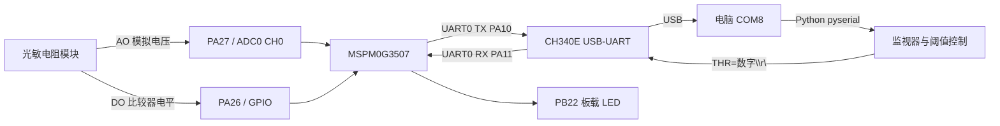
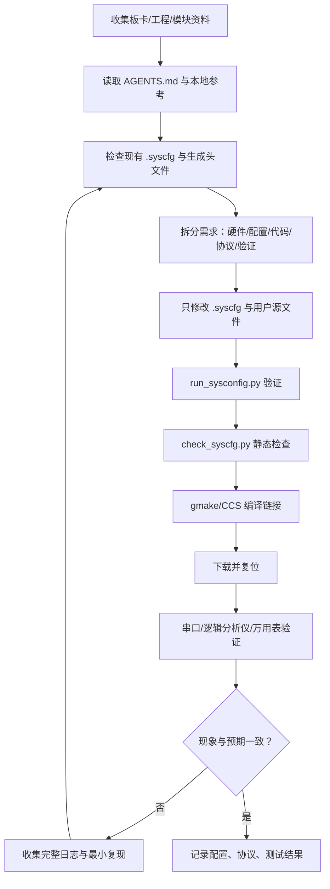

# MSPM0G3507 串口、光敏传感器与 AI Agent 开发学习总结

本文以当前的 `photoresistor_uart` 工程为例，解释电脑串口通信、MSPM0G3507 串口收发、LM393 光敏电阻模块，以及如何让 AI Agent 协助完成一个可验证的嵌入式项目。目标读者是刚开始学习 TI MSPM0、CCS Theia、SysConfig 和 DriverLib 的同学，后续可以把这套方法迁移到智能车的循迹、定点、测速和 PID 控制。

本文引用的本地资料包括：

- [MSPM0 CCS 开发规范](../skills/mspm0-ccs/SKILL.md)
- [天猛星 Wiki 本地整理](../docs/tmx-mspm0g3507-wiki-summary.md)
- [LP-MSPM0G3507 本地参考索引](../docs/reference/LP-MSPM0G3507/INDEX.md)
- [当前工程说明](README.md)

对应的原始 Wiki 页面：

- [天猛星 CCS-Theia 入门](https://wiki.lckfb.com/zh-hans/tmx-mspm0g3507/ccs-beginner/)
- [UART 入门](https://wiki.lckfb.com/zh-hans/tmx-mspm0g3507/ccs-beginner/uart.html)
- [ADC 采集](https://wiki.lckfb.com/zh-hans/tmx-mspm0g3507/ccs-beginner/adc.html)
- [光敏电阻光照传感器](https://wiki.lckfb.com/zh-hans/tmx-mspm0g3507/module/sensor/photoresistance-sensor.html)
- [TI 简易 PID 入门项目](https://wiki.lckfb.com/zh-hans/tmx-mspm0g3507/training/easy-pid-beginner-kit/)

---

## 0. 先看当前工程到底做了什么

当前项目不是一个抽象示例，而是一个已经按天猛星 MSPM0G3507 配置的 CCS 工程：

| 项目 | 当前配置 |
|---|---|
| MCU | MSPM0G3507，LQFP-64(PM) |
| 工程 | 当前文件所在的 `photoresistor_uart/` |
| SysConfig 源文件 | `photoresistor_uart.syscfg` |
| 应用入口 | `photoresistor_uart.c` |
| AO | PA27，ADC0 通道 0，12 位 ADC |
| DO | PA26，GPIO 输入，上拉 |
| 板载 LED | PB22，由软件阈值控制 |
| USB 串口 | UART0，PA10 TX、PA11 RX，经 CH340E 到电脑 |
| 串口格式 | 115200 baud，8 数据位，无校验，1 停止位（115200-8-N-1） |
| ADC 参考 | VDDA，当前按 3.3 V 换算 |
| 电脑程序 | `photoresistor_monitor.py`，使用 `pyserial` |

单片机周期发送类似数据：

```text
AO=1029  V=0.829 V  DO=1 SW=1 THR=1000
```

字段含义：

- `AO`：ADC 原始值，范围 0–4095。
- `V`：按当前 VDDA=3.3 V 估算的输入电压。
- `DO`：LM393 模块的硬件数字输出。
- `SW`：单片机根据 AO 和软件阈值的判断结果。
- `THR`：当前软件阈值。

注意：模块上的蓝色电位器只能改变 LM393 的硬件比较阈值，因此影响 `DO`；Python 发送的 `THR=...` 改变的是单片机软件判断和 PB22 板载 LED，并不会物理旋转模块电位器。

---

## 1. 电脑控制的串口通信

### 1.1 串口通信的完整链路

电脑上的程序并没有直接读取 PA27。数据链路是：



电脑串口程序的职责有三个：

1. 打开正确的 COM 端口。
2. 按与单片机相同的波特率和帧格式接收字节。
3. 按协议把字节组织成一行数据，并在需要时发送命令。

### 1.2 UART 的四个关键参数

当前使用：

```text
baud rate = 115200
data bits = 8
parity    = none
stop bits = 1
```

两端必须一致。波特率不一致时，最常见的现象是乱码；端口被占用时，Python 会报 `PermissionError(13)`；端口正确但没有数据时，通常要检查固件是否运行、TX/RX 是否接反、GND 是否共地、板子是否复位。

天猛星本地资料说明，板载 CH340E 连接 UART0 的 PA10/PA11。PA10、PA11 是板卡上的特殊引脚，但它们正是板载 USB 串口的默认连接，不能随意改作其他外设。

### 1.3 TX、RX 和 GND 为什么这样接

UART 是异步串行通信：

- MCU TX 发出的数据进入电脑端 RX。
- 电脑端 TX 发出的数据进入 MCU RX。
- 两边必须共用 GND，电平才有共同参考。

因此外接 USB-UART 时通常是：

```text
MCU TX  -> USB-UART RX
MCU RX  -> USB-UART TX
MCU GND -> USB-UART GND
```

当前使用板载 CH340E，线路已经在板上完成。设备管理器中看到的 `USB-SERIAL CH340 (COM8)` 是电脑侧端口名，不是 MCU 的 UART 实例名。

### 1.4 Python 程序怎样打开串口

最小示例：

```python
import serial

port = serial.Serial("COM8", 115200, timeout=1)
line = port.readline().decode("ascii", errors="replace").strip()
print(line)
port.close()
```

当前程序使用 `with serial.Serial(...)` 自动关闭端口，并用后台线程持续读取。主线程负责键盘操作和单行刷新。这样接收数据不会被等待键盘输入阻塞。

### 1.5 当前通信协议

单片机发送文本行，结尾是 `\r\n`：

```text
AO=1029  V=0.829 V  DO=1 SW=1 THR=1000\r\n
```

电脑发送的命令也是文本行：

```text
THR=2500\r\n
GET\r\n
```

单片机回复：

```text
OK THR=2500\r\n
THR=2500\r\n
```

文本协议适合入门，因为可以直接用串口终端观察和手工发送。智能车后期需要更高频率、更严格的可靠性时，可以换成二进制帧，例如：

```text
帧头 | 命令 | 长度 | 数据 | 校验和
```

但不要一开始就使用复杂协议。先让 UART 收发、传感器读取和异常处理都可观察，再考虑 CRC、序号和重发。

### 1.6 当前 Python 监视器的工作方式

运行：

```powershell
python -m pip install pyserial
python photoresistor_monitor.py --port COM8
```

程序保持一行显示：

```text
AO=1029  0.829 V  硬件DO=1  软件=1  阈值=1000   [+/-]±50 [/]±10 [g]查询 [q]退出
```

键盘控制：

- `+`、`-`：阈值变化 50。
- `]`、`[`：阈值变化 10。
- `g`：查询阈值。
- `q`：退出。

程序曾经出现过“始终等待单片机数据”的问题，原因不是波特率，而是正则表达式漏掉了电压后的文字 `V`。真实数据是 `V=0.829 V DO=1`，修正后才能匹配。这是串口调试的典型教训：先看原始字节，再检查解析规则，不要直接把“解析失败”误判为“硬件没有发送”。

---

## 2. 单片机串口回发

### 2.1 初始化顺序

单片机应用入口必须先调用 SysConfig 生成的初始化函数：

```c
int main(void)
{
    SYSCFG_DL_init();
    // 之后才能使用 ADC、UART、GPIO 等生成的实例
}
```

当前工程的 `SYSCFG_DL_init()` 会初始化：

- 系统时钟。
- UART0 的 PA10/PA11 复用和 115200 参数。
- ADC0 和 PA27 模拟输入。
- PA26 GPIO 输入。
- PB22 LED 输出。

这些初始化属于 `.syscfg` 的职责，不应在 `photoresistor_uart.c` 中重新手动配置寄存器。

### 2.2 串口发送

当前采用阻塞发送，适合低速调试输出：

```c
static void uart_putc(char c)
{
    DL_UART_Main_transmitDataBlocking(UART_0_INST, (uint8_t)c);
}

static void uart_puts(const char *s)
{
    while (*s != '\0') {
        uart_putc(*s++);
    }
}
```

阻塞发送的意思是：发送函数会等待 UART 硬件把字符放进发送路径后再返回。优点是简单、可靠、容易调试；缺点是大量打印会占用 CPU，不能直接用于高频控制环。

智能车中建议把串口输出分成两类：

- 调试日志：低频输出，例如每 100–500 ms 一次。
- 控制数据：固定周期、短帧、尽量不阻塞，例如每 10–20 ms 只发送必要字段，或者使用 DMA。

### 2.3 串口接收中断

SysConfig 中打开 UART0 的 RX 中断，应用代码启用 NVIC：

```c
NVIC_EnableIRQ(UART_0_INST_INT_IRQN);
```

中断函数读取收到的字节：

```c
void UART_0_INST_IRQHandler(void)
{
    if (DL_UART_Main_getPendingInterrupt(UART_0_INST) == DL_UART_MAIN_IIDX_RX) {
        char c = (char)DL_UART_Main_receiveData(UART_0_INST);
        // 保存 c，交给主循环解析
    }
}
```

中断里只做快速工作：读出字节、保存到缓冲区、设置标志。不要在 ISR 里做浮点计算、长时间延时、阻塞发送或复杂协议解析。

当前工程采用的命令流程是：

```text
RX 中断收到字符
        ↓
写入 g_command 缓冲区
        ↓
收到回车/换行，设置 g_command_ready
        ↓
主循环发现标志
        ↓
解析 THR=数字 或 GET
        ↓
更新阈值并回发 OK
```

与 ISR、主循环共享的变量需要 `volatile`，否则编译器可能认为变量不会被中断异步改变：

```c
static volatile bool g_command_ready;
static volatile uint8_t g_command_index;
static volatile char g_command[20];
```

### 2.4 ADC 采样和串口发送的关系

当前主循环大致是：

```c
启动 ADC 转换
等待 ADC 中断完成
读取 12 位结果
读取 PA26 的 DO
比较软件阈值
控制 PB22 LED
通过 UART 输出一行
延时约 200 ms
```

这是一个适合入门的“轮询主循环 + 外设中断”结构。智能车开发时要逐步改成：

- 定时器产生固定采样节拍。
- ADC 用定时器触发，必要时使用 DMA。
- UART 发送使用环形缓冲区或 DMA。
- 控制算法按固定周期执行，例如 1 ms、5 ms 或 10 ms。

不要把 `delay_cycles()` 当成高精度控制定时器。它依赖 CPUCLK，改了时钟后延时时间会变化。真正的循迹和 PID 控制应使用定时器或 SysTick，并检查 SysConfig 生成的时钟频率和重装值。

---

## 3. 光敏传感器的应用

### 3.1 LM393 模块的两个输出

模块包括光敏电阻、分压网络、LM393 比较器、电位器和指示灯：

- AO：模拟输出，电压随光照变化，接 ADC。
- DO：数字输出，AO 与电位器设定的比较电平经过 LM393 后得到高/低电平。
- VCC：当前建议接 3.3 V。
- GND：接开发板 GND。

天猛星本地资料给出的光敏模块接线是：VCC→3V3、GND→GND、DO→PA26、AO→PA27。当前工程采用了同样的接线。

### 3.2 AO 的数值换算

12 位 ADC 的理论范围：

```text
0             -> 0 V
4095          -> VDDA
```

当前代码的近似换算：

```c
millivolts = (raw * 3300U + 2047U) / 4095U;
```

这只是电压估算。实际值会受到 VDDA、电阻误差、模块分压关系、ADC 采样时间和噪声影响。光敏模块的 AO 方向也要通过实测确认：某些模块光照变强时 AO 上升，另一些分压方向相反。

### 3.3 硬件阈值与软件阈值

当前系统同时保留两种阈值：

| 阈值 | 由谁设置 | 影响 |
|---|---|---|
| 硬件阈值 | 模块蓝色电位器 | LM393 的 DO 和模块 DO 指示灯 |
| 软件阈值 | Python 发送 `THR=...` | MSPM0 的 `SW` 字段和 PB22 板载 LED |

二者不要混淆。Python 不能直接控制模块电位器；如果要求远程改变真正的 LM393 阈值，需要额外硬件，例如数字电位器、DAC 或由 MCU 输出 PWM 后经过滤波形成参考电压。

### 3.4 传感器工程化处理

直接使用单次 ADC 值容易抖动。常见改进顺序：

1. 多次采样取平均。
2. 使用滑动平均或一阶低通滤波。
3. 给软件阈值增加滞回，例如上升阈值 2200、下降阈值 2100。
4. 对异常值做范围检查。
5. 记录最小值、最大值和静态噪声，再决定阈值。

滞回逻辑示例：

```c
if (!light_on && raw >= threshold_high) {
    light_on = true;
}
if (light_on && raw <= threshold_low) {
    light_on = false;
}
```

这比简单的 `raw >= threshold` 更适合继电器、LED、舵机和电机控制，能够避免信号在临界点附近反复翻转。

### 3.5 迁移到智能车循迹

光敏电阻可以帮助理解 ADC，但它不是理想的高速循迹传感器。智能车通常使用多个红外反射/灰度传感器：

- 每个传感器输出一个 ADC 值或 DO。
- 多通道 ADC 同时读取地面明暗差异。
- 根据传感器位置计算横向误差。
- 用误差驱动左右轮速度差。

一个五路传感器的加权误差思路：

```text
位置权重 = [-2, -1, 0, +1, +2]
error = Σ(传感器有效程度 × 位置权重) / Σ(传感器有效程度)
```

然后使用：

```text
left_pwm  = base_pwm - PID(error)
right_pwm = base_pwm + PID(error)
```

天猛星 Wiki 的 PID 项目给出过类似的智能车资源：PA26/PA27 可用于电机 PWM，PB00/PB01 等可用于编码器输入，按键、屏幕和定时器组成前台状态机与后台周期控制。实际工程必须以当前电机驱动板、传感器数量和 SysConfig 引脚分配为准，因为 PA26/PA27 在不同项目中可能被分配给 ADC、PWM 或其他外设。

---

## 4. AI Agent 参与嵌入式项目的完整流程

AI Agent 最适合做“资料整理、配置检查、重复性修改、日志分析和小步验证”。它不能凭空知道你的板卡接线，也不能把没有连接的硬件验证成成功。因此，正确的流程不是一句“帮我写个程序”，而是让 AI 逐步获得可靠上下文和可检查的证据。

### 4.1 初始化阶段：先建立事实

开始新项目时，先收集并固定这些事实：

| 类别 | 需要确认的资料 |
|---|---|
| MCU | MSPM0G3507、封装、Flash/SRAM |
| 开发环境 | CCS Theia 版本、TI Arm Clang、SDK 版本、SysConfig 版本 |
| 板卡 | 天猛星具体版本、原理图、排针编号、板载资源 |
| 下载器 | XDS110、J-Link 或其他探针；`.ccxml` 必须匹配 |
| 外设 | UART/ADC/PWM/TIMER/编码器实例和引脚 |
| 外部模块 | 型号、供电、逻辑电平、接线、协议、时序 |
| 需求 | 输入、输出、周期、阈值、异常行为和验收方法 |
| 现状 | 当前源文件、`.syscfg`、生成头文件、构建日志、串口日志 |

AI Agent 的第一步应当是读取本地 `AGENTS.md`、技能文件、本地 Wiki 摘要和当前工程，而不是立即修改代码。

### 4.2 需求如何拆解

把一句需求拆成六层：

#### A. 硬件层

```text
模块是什么？
供电多少伏？
输出是模拟、数字、UART、I2C、SPI 还是 PWM？
TX/RX 是否交叉？是否共地？
有没有复位、使能、片选、地址脚？
```

#### B. 引脚层

```text
AO -> PA27
DO -> PA26
UART0 TX/RX -> PA10/PA11
```

必须通过板卡文档、芯片封装和 SysConfig 共同确认，不能仅凭“某个教程用过这个名字”推断。

#### C. 配置层

```text
ADC 分辨率、参考电压、采样时间
UART 波特率、校验位、FIFO、中断
GPIO 输入上拉、输出初值
Timer 周期和中断事件
DMA 通道和触发源
```

#### D. 固件层

```text
初始化
采样
滤波
状态判断
串口协议
错误处理
```

#### E. 电脑工具层

```text
串口打开
数据解析
可视化
参数下发
日志保存
```

#### F. 验证层

```text
静态检查
SysConfig 生成
编译
链接
下载
串口观察
改变光照/输入并验证响应
```

### 4.3 配置文件的职责

当前工程要牢记以下边界：

- `photoresistor_uart.syscfg`：配置源，负责设备、引脚、时钟、ADC、UART、GPIO、中断。
- `ti_msp_dl_config.h/.c`：SysConfig 生成，不手工编辑。
- `photoresistor_uart.c`：用户逻辑，负责状态机、采样处理、协议解析。
- `targetConfigs/MSPM0G3507.ccxml`：下载/调试探针配置。
- `Debug/`：编译生成物，不作为长期手工编辑入口。
- `photoresistor_monitor.py`：电脑端工具，与固件协议保持一致。

如果要改变引脚或外设，先改 `.syscfg`，再运行 SysConfig，检查生成头文件中的宏名和 IRQ 名称，最后修改 C 代码。不要直接改 `Debug/ti_msp_dl_config.h` 来“临时修好”引脚。

### 4.4 推荐的 AI Agent 工作循环



每轮只改一个主要变量。例如先让 UART 固定发送 `hello`，再加入 ADC；先验证单路 ADC，再加入滤波；先让单电机 PWM 转动，再加入编码器和 PID。这样 AI 和人都能知道是哪一步引入了问题。

### 4.5 给 AI Agent 的高质量资料包

向 AI 请求开发帮助时，最好一次提供：

```text
芯片：MSPM0G3507，封装 LQFP-64
板卡：LCKFB 天猛星 MSPM0G3507
SDK：2.11.0.07
SysConfig：工程声明 1.26.2，机器安装 1.28.1
编译器：TI Arm Clang
工程路径：...
入口文件：...
当前接线：AO=PA27，DO=PA26，VCC=3V3，GND=GND
串口：UART0，PA10/PA11，115200-8-N-1，COM8
目标行为：每 200 ms 发送 AO/DO；接收 THR=数字
当前文件：.syscfg、用户 C 文件、生成头文件
完整错误：从第一行到最后一行
已经验证的事实：串口能否打开、是否有输出、输出原文
```

图片也要说明它是“模块接线图”“板卡原理图”还是“设备管理器截图”，并指出希望 AI 从图中确认什么。图片上的教程文字是参考，不会自动覆盖当前工程实际配置。

### 4.6 AI Debug 的证据顺序

遇到问题时，按以下顺序提供证据：

1. 电脑是否能打开 COM 端口。
2. 端口号、波特率、校验位是否一致。
3. 原始串口字节或原始文本是什么。
4. 固件启动信息是什么。
5. `.syscfg` 是否通过 SysConfig 生成。
6. `check_syscfg.py`、编译、链接是否成功。
7. 下载器是否识别芯片。
8. 实物电源、GND、TX/RX、模块电压是否正确。
9. ADC 原始值在遮光、照光、断线时怎样变化。

典型判断：

| 现象 | 优先怀疑 |
|---|---|
| COM8 打不开 | 其他程序占用、端口号变化、设备管理器状态 |
| 乱码 | 波特率/格式不一致、电平或线路问题 |
| 串口工具能看到，Python 看不到 | Python 解析规则、换行符、端口被多个程序抢占 |
| 只有启动信息没有数据 | 主循环卡在 ADC、ADC 中断未开、供电/引脚配置问题 |
| AO 总是 0 或 4095 | 接线、参考电压、通道选择、输入超范围 |
| DO 反向 | 模块比较器逻辑或板上 LED 极性，不一定是代码错误 |
| 编译成功但下载失败 | 探针、`.ccxml`、驱动、复位、目标供电 |
| 下载成功但复位后不跑 | 时钟树、复位方式、启动配置、生成文件是否匹配 |

### 4.7 一个合格的 Debug 请求模板

```text
请调试当前 MSPM0G3507 工程，不要先改代码。

目标：Python 读取 UART0 的光敏 ADC 数据。
当前接线：AO=PA27，DO=PA26，CH340=COM8。
预期：115200-8-N-1，每 200 ms 一行。
实际：Python 显示“等待单片机数据”。
串口工具原始输出：
AO=1029  V=0.829 V  DO=1 SW=1 THR=1000

请先检查：
1. Python 正则是否匹配原始行；
2. 波特率和换行；
3. 是否有串口占用；
4. 给出最小修复并运行 py_compile。
```

这个模板比“串口不行，帮我修”有效，因为它把问题限制在可验证的范围内。

---

## 5. 面向智能车的学习路线

建议按下面顺序推进，每一步都保留可运行版本：

### 阶段 1：GPIO 和串口

- PB22 LED 点亮、熄灭、翻转。
- PB21 按键读取，认识上拉和低电平有效。
- UART0 发送固定字符串。
- Python 读取并显示字符串。

### 阶段 2：单路 ADC

- PA27 读取电压。
- 遮光、照光、断开输入，记录 ADC 范围。
- 取平均、滤波、阈值和滞回。
- Python 显示原始值、电压和状态。

### 阶段 3：多路循迹

- 将一只传感器扩展成三路或五路红外/灰度传感器。
- 在 SysConfig 中逐一确认 ADC 通道和 GPIO。
- 用加权法计算位置误差。
- 先用串口把传感器数组和误差打印出来。

### 阶段 4：PWM 和电机

- 单路 PWM 驱动一个电机，确认频率和占空比。
- 增加方向脚和使能脚。
- 两个电机分别测试正转、反转、停止。
- 注意 PA26/PA27 在电机项目中可能被用于 PWM，不能与 ADC 配置同时占用。

### 阶段 5：编码器和速度

- 读取 A/B 相位。
- 使用定时器固定采样周期。
- 计算脉冲数、方向和速度。
- 先做开环速度测量，再做闭环控制。

### 阶段 6：PID 循迹与定点

- 位置环：传感器误差 → 左右轮差速。
- 速度环：编码器速度 → PWM 修正。
- 定点：编码器累计脉冲 → 目标距离误差。
- 参数调节顺序：先 Kp，再 Ki，最后少量 Kd；加入积分限幅和输出限幅。

### 阶段 7：状态机和上位机

- `IDLE`、`CALIBRATE`、`LINE_FOLLOW`、`POINT_STOP`、`ERROR` 等状态。
- Python 用于调参、显示波形和保存数据。
- 运行时参数通过 UART 下发，复位后从默认值开始，稳定后再考虑 Flash 保存。

---

## 6. 当前工程的验证清单

已经完成或可复现的检查：

- `.syscfg` 静态检查通过。
- SysConfig 可生成 ADC、GPIO、UART 配置。
- TI Arm Clang 编译成功。
- 链接成功生成 `Debug/photoresistor_uart.out`。
- 成功生成 [photoresistor_uart.hex](photoresistor_uart.hex) 和 [photoresistor_uart.txt](photoresistor_uart.txt)。
- 连接 COM8 后，115200 下能看到 AO/DO/SW/THR 数据。
- 发送 `THR=1000` 能收到 `OK THR=1000`。

尚未由 AI 代替用户完成的事项：

- 不能声称模块长期稳定性、照度标定和智能车实际循迹效果已经验证。
- 光敏电阻 AO 与真实 lux 的关系没有标定，当前电压不是照度单位。
- 没有在实际电机、编码器和赛道上验证 PID 参数。

---

## 7. 最重要的工程习惯

1. 先确认硬件事实，再写代码。
2. `.syscfg` 是引脚、时钟、外设、中断和 DMA 的配置源。
3. 生成文件不要手工编辑。
4. ISR 只做快速搬运和置标志，主循环或任务做解析和业务。
5. 串口协议要有明确的帧结束符、字段含义和错误回复。
6. 编译通过不等于下载成功，下载成功不等于接线正确，串口有输出也不等于传感器标定完成。
7. 每次只改变一个主要因素，并保留原始日志。
8. 给 AI 的信息越接近“芯片、引脚、配置、日志、预期、实际”，Debug 越可靠。
9. 智能车控制周期必须由定时器等可靠时基产生，不要依赖不可校准的长延时。
10. 从 LED、UART、ADC 单路验证开始，再进入多传感器、电机、编码器和 PID。

这条路线的核心不是一次性写出完整智能车，而是让每个外设、每条数据链和每个控制环都能单独测量、解释和复现。
